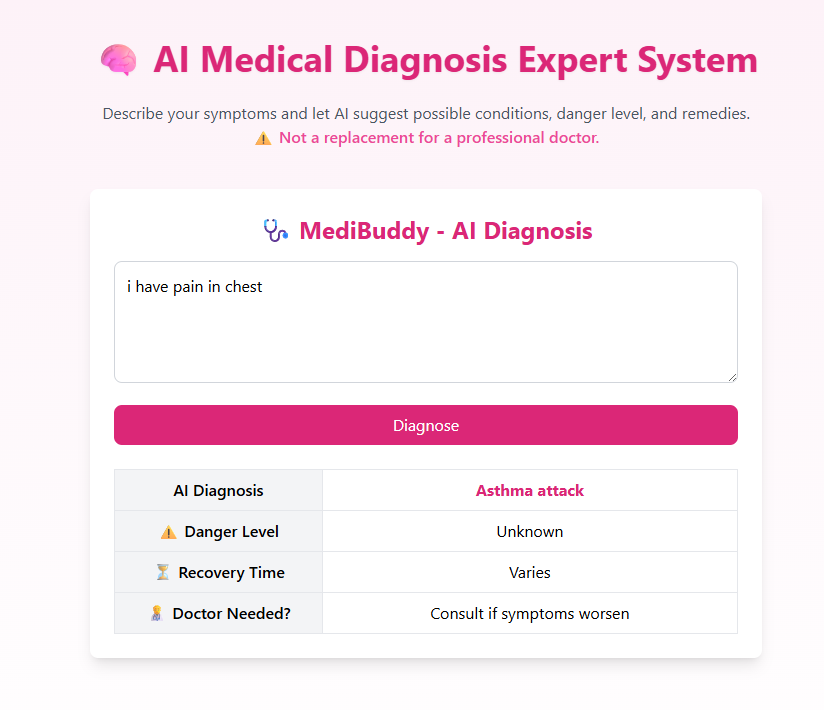

---

# 🧠 MediBuddy – AI Medical Diagnosis Expert System

**MediBuddy** is an **AI-powered hypothesis-based medical diagnosis system** built using **React**, **Vite**, **Tailwind CSS**, and Hugging Face's AI models.

It enables users to input their symptoms and receive **AI-generated diagnosis suggestions**, including:
- ⚠️ **Danger Level** of the condition  
- ⏳ **Estimated Recovery Time**  
- 👨‍⚕️ **Doctor Consultation Advice**  
- 💊 **Suggested Medicines** (OTC)  
- 🌿 **Non-Medicine Remedies**

> **Disclaimer:** MediBuddy is for **educational and informational purposes only** and is **NOT** a substitute for professional medical advice, diagnosis, or treatment.

---

## 🚀 Features

- 🤖 **AI Hypothesis Engine** – Utilizes Hugging Face's [`deepset/roberta-base-squad2`](https://huggingface.co/deepset/roberta-base-squad2) for natural language processing.
- 🔍 **Dynamic Symptom Analysis** – Enriches AI results with a local medical knowledge base.
- 💊 **Multiple Suggestions** – Provides both medications and natural remedies.
- ⚠️ **Danger Assessment** – Helps users gauge the severity of their condition.
- 🎨 **Modern UI** – Built with Tailwind CSS for a responsive, user-friendly experience.

---

## 🛠️ Tech Stack

| Category         | Tools/Frameworks                        |
|------------------|-----------------------------------------|
| **Frontend**     | React, Vite, Tailwind CSS               |
| **AI Model**     | Hugging Face – [`deepset/roberta-base-squad2`](https://huggingface.co/deepset/roberta-base-squad2) |
| **HTTP Client**  | Axios                                   |
| **State Mgmt.**  | React Hooks                             |

---

## 📦 Installation

1. **Clone the repository**
   ```bash
   git clone https://github.com/Chirag-varu/MediBuddy.git
   cd MediBuddy
   ```

2. **Install dependencies**
   ```bash
   npm install
   ```

3. **Set up environment variables**  
   Create a `.env` file in the root directory:
   ```env
   VITE_HUGGINGFACE_API_KEY=your_huggingface_api_key_here
   ```

4. **Run the development server**
   ```bash
   npm run dev
   ```

---

## 📄 Example Usage

**Input:**  
> I have fever, sore throat, and cough for 3 days.

**Output:**

| Field              | Example                                                       |
|-------------------|---------------------------------------------------------------|
| AI Diagnosis       | Influenza (Flu)                                               |
| Danger Level       | Moderate                                                      |
| Recovery Time      | 5–10 days                                                     |
| Doctor Needed?     | Yes, if high fever > 3 days or breathing difficulty           |
| Symptoms           | Fever, cough, body aches, fatigue, sore throat               |
| Medicine           | Paracetamol, cough syrup                                      |
| Non-Medicine       | Rest, warm fluids, salt water gargle                         |

---

## 📌 Notes

- The AI engine hypothesizes potential illnesses by blending model predictions with curated medical data.
- It smartly maps variations like “flu”, “influenza”, or “common cold” to structured diagnoses.
- The more precise the symptom input, the better the suggestions.

---

## 🖼️ Preview Screenshot



---

## ⚠️ Disclaimer

This project is intended for educational use only and **should not replace professional medical consultation**. Always seek guidance from licensed healthcare providers.

---

## **License** 📜
This project is licensed under the [MIT License](LICENSE).
You are free to use, modify, and distribute this software with proper attribution.
---